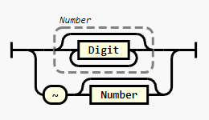

# CLI API Design

## Commands

| Command                 | Details                                         |
| ----------------------- | ----------------------------------------------- |
| `clip list`             | List clipboard history items                    |
| `clip show <pattern>`   | Show details on a saved clipboard item          |
| `clip copy <pattern>`   | Copy a previous clipboard item to the clipboard |
| `clip remove <pattern>` | Remove a clipboard item                         |

### Offset patterns

**Examples**

`0, 123, ~, ~5`

**Diagram**

